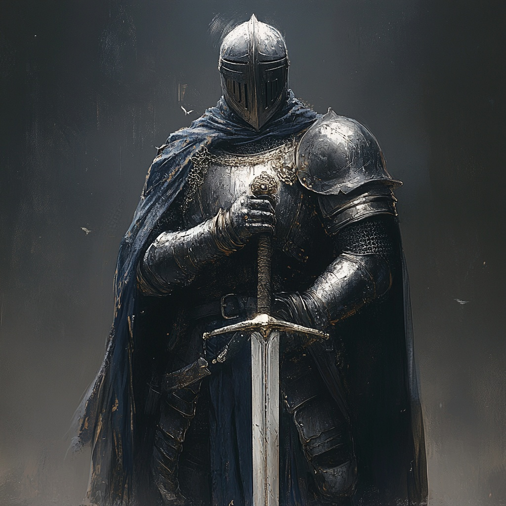

# Medieval Kights
**Medieval Knights created in AI**

Description:
dark warrior knight dressed in armor and chain mail, helmet on his head, crusade, holds a classic sword with both hands, 3d render style, black background, --ar 2:3

[Medieval Knight - Dark Warrior - Link](https://www.midjourney.com/jobs/04231fa3-ffa6-4d86-9bd7-2d98d03caa3f?index=0)

[Medieval Knight - Fantansy Knight - Link](https://www.midjourney.com/jobs/de64df5c-12f9-4472-b8a3-938452b8fdc9?index=0)

[Medieval Knight - Fantansy Knight - Link](https://www.midjourney.com/jobs/e61b2391-5002-4e27-be0a-e4d28187ca03?index=0)

[Medieval Knight - Fantansy Knight - Link](https://www.midjourney.com/jobs/0721e582-8558-44da-81ad-72bfbf66ca38?index=0)

[Medieval Knight - Fantansy Knight - Link](https://www.midjourney.com/jobs/3688387f-5295-4f2c-b9a1-8fc00a085988?index=0)
description: 5 knights standing side by side with a sword putting in front of themselves.

[Medieval Knight - Fantansy Knight - Link](https://www.midjourney.com/jobs/bcd20d3a-717f-49e4-8b04-5b79e47faf14?index=0)
description: a group of three knights one in red armour one in black armour and last in silver armour all wearing heavy armor the knight in the center has horns attached to his helmets

[Medieval Knight - Fantansy Knight - Link](https://www.midjourney.com/jobs/3688387f-5295-4f2c-b9a1-8fc00a085988?index=0)
description: Three armored knights being resurrected by necromantic powers, 4k resolution, epic, insanely detailed, vivid colors, award-winning photography style
